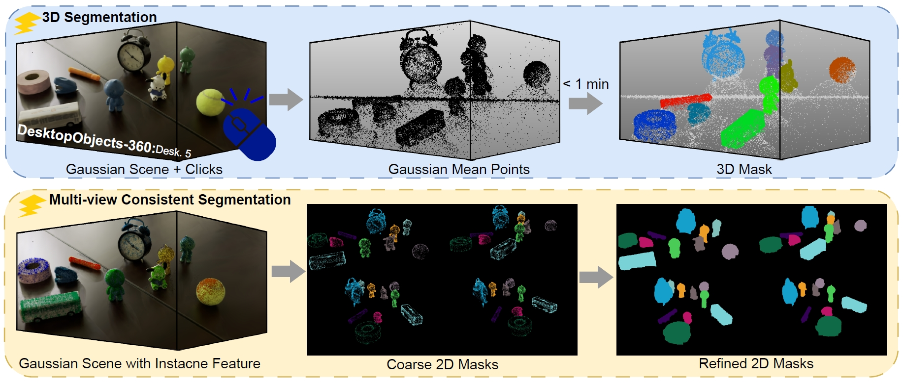
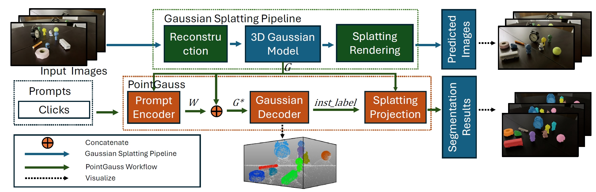
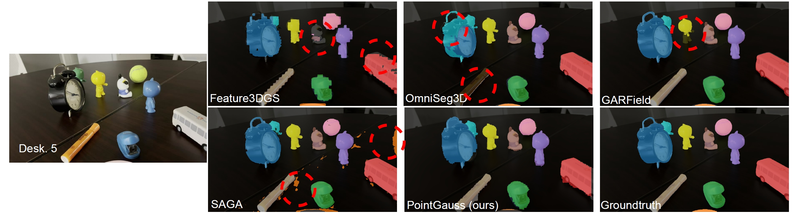

# PointGauss: Point Cloud-Guided Multi-Object Segmentation for Gaussian Splatting

This repository is the official implementation of [PointGauss]. 




## Dataset Download
Please download the DesktopObjects-360 (https://dataverse.harvard.edu/dataset.xhtml?persistentId=doi:10.7910/DVN/OEVWCD) and unzip it. Put the whole datasets into the data/ folder. 


## Requirements (The completed code will come soon)
(Recommendation)
CUDA: >= 11.8
PyTorch: >= 2.1.0

## Environment
To install requirements:

```setup
conda env create --file environment.yml
conda activate pointgauss
conda install ninja -y
conda install h5py pyyaml
conda install sharedarray tensorboard tensorboardx yapf addict einops scipy plyfile termcolor timm
conda install pytorch-cluster pytorch-scatter pytorch-sparse
pip install torch-geometric
git clone https://github.com/Pointcept/Pointcept.git
cd Pointcept/libs/pointops
python setup.py install
cd ../../../
pip install spconv-cu118
```


## Data Prepare
Please download the DesktioObjects-360 datasets,
Unzup PointCloud.7z Then put point cloud data in /data/points
Use the following command to generate train.h5 and test.h5
```data
python prepare_data.py
```
Then put train.h5 and test.h5 into /data/


## Point Cloud Model Training

To train the point cloud segmentation model(s) in the paper, run this command:

```train
python train_ptv3.py --grid_size 0.02 --cfg ptv3.yaml
```
arguments:
--data_channel : Which channel(s) are used to train


## 3D mask and evaluation
Put the pretrained gaussian model into 'data/3dgs'
To predict gaussian model's 3D mask, run this command: 

```eval
python train_ptv3.py --grid_size 0.02 --cfg ptv3.yaml --n_clicks 20 --testscene --model /checkpoints/ptv3isg.pth
```
arguments:
--n_clicks : the number of clicks used in objects

After getting the annotated gaussian model in outputs/ folder,
replace the original gaussian model in '/output/' with this annotated gaussian model

## Generate multi-objects multi-view consistent segmentation masks 

The completed algorithm will come soon.

## Results
To evaluat the performance, run this command:
```eval
python eval_metrics.py
```
Our model achieves the following performance on :

### [Desktopobjects-360]

| Model name         |     Desk. 1                  |    Desk. 2                  |
| ------------------ |-3D-IoU 2D-IoU  Accuracy      | 3D-IoU  2D-IoU  Accuracy    |
| PointGauss         | 69.40% 84.33% 95.90%         |  82.46% 86.91% 96.67%       |

| Model name         |     Desk. 3                  |    Desk. 4                  |
| ------------------ |-3D-IoU 2D-IoU  Accuracy      | 3D-IoU  2D-IoU  Accuracy    |
| PointGauss         | 73.38% 85.85% 94.54%         |  78.05% 89.36% 97.68%       |

| Model name         |     Desk. 5                  |    Desk. 6                  |
| ------------------ |-3D-IoU 2D-IoU  Accuracy      | 3D-IoU  2D-IoU  Accuracy    |
| PointGauss         | 80.94% 85.55% 96.76%         |  77.67% 91.12% 99.31%       |

